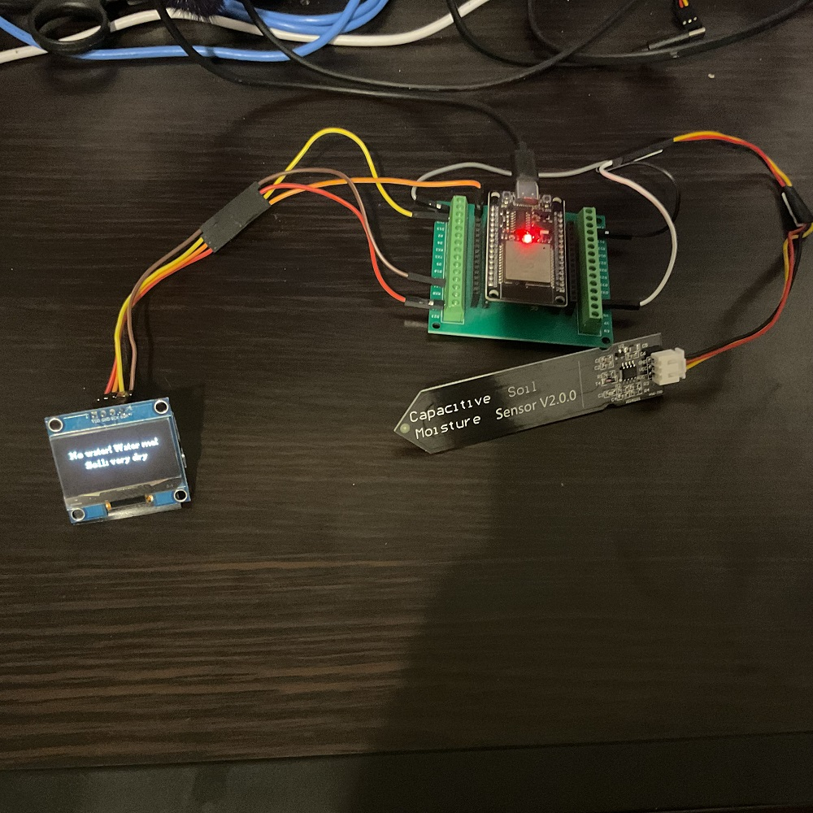

# WaterMe

## How to Download the Project  
[➡️ DOWNLOAD](#download-the-project)

---

## How It Works  
The soil sensor measures the moisture level in the soil. When the soil gets dry, the sensor sends a signal to the ESP32, which then displays the moisture status on the OLED screen. This way, you can monitor the soil moisture in real time and take action to water the plants if needed.


---

## Items You Need to Build It  
- [OLED Panel](https://pl.aliexpress.com/item/1005006127524245.html?spm=a2g0o.order_list.order_list_main.147.5ba21c24c2UhEE&gatewayAdapt=glo2pol)  
- [Soil Sensor](https://pl.aliexpress.com/item/1005008094581948.html?spm=a2g0o.order_list.order_list_main.35.5ba21c24c2UhEE&gatewayAdapt=glo2pol)  
- [ESP32](https://pl.aliexpress.com/item/1005006128432036.html?spm=a2g0o.productlist.main.2.751fccIvccIvG3&algo_pvid=74354bc7-a9b5-4c25-96ca-83337bb5ec19&algo_exp_id=74354bc7-a9b5-4c25-96ca-83337bb5ec19-1&pdp_ext_f=%7B%22order%22%3A%22437%22%2C%22eval%22%3A%221%22%7D&pdp_npi=4%40dis%21PLN%218.90%218.24%21%21%2117.21%2115.93%21%40211b80e117520577387293281e5c3b%2112000046958263336%21sea%21PL%212735011418%21X&curPageLogUid=4JMtoDKPQxpF&utparam-url=scene%3Asearch%7Cquery_from%3A)  

---

## How to Connect to the ESP32

**OLED connections:**  
- VDD → ESP32 3V3  
- GND → ESP32 GND  
- SCK → ESP32 Pin 22  
- SDA → ESP32 Pin 21  

**Soil Sensor connections:**  
- GND → ESP32 GND  
- VCC → ESP32 3V3  
- AOUT → ESP32 Pin 34  



---

## Download the Project

```bash
git clone --filter=blob:none --no-checkout https://github.com/mmonekyy/ESP32-Pi.git
cd ESP32-Pi
git sparse-checkout init --cone
git sparse-checkout set WaterMe
```
